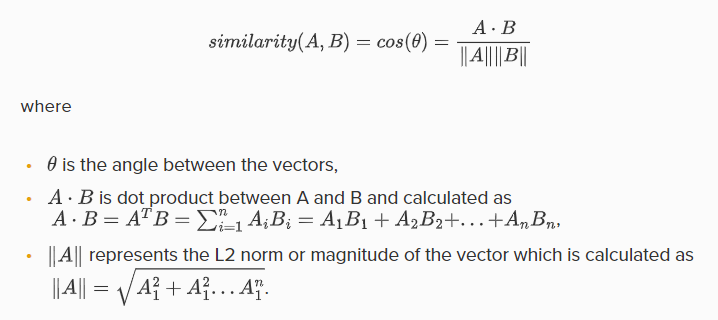
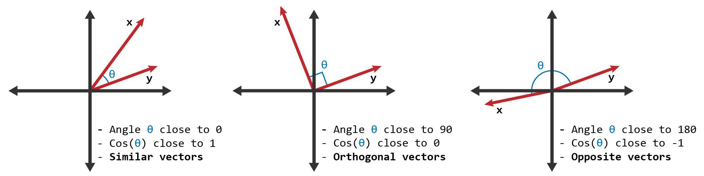
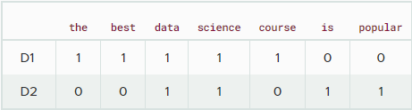
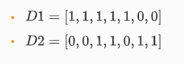
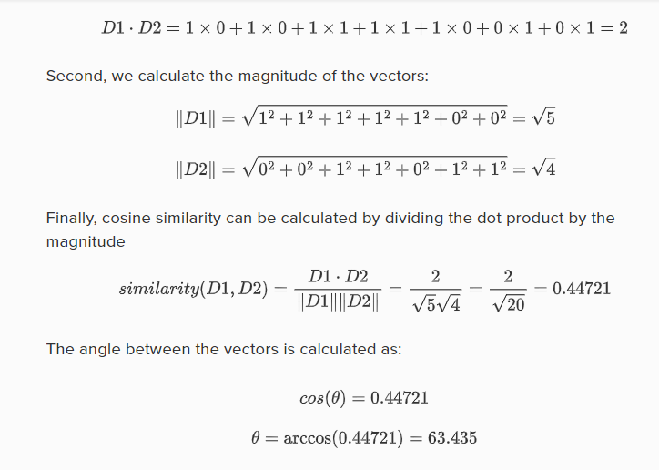
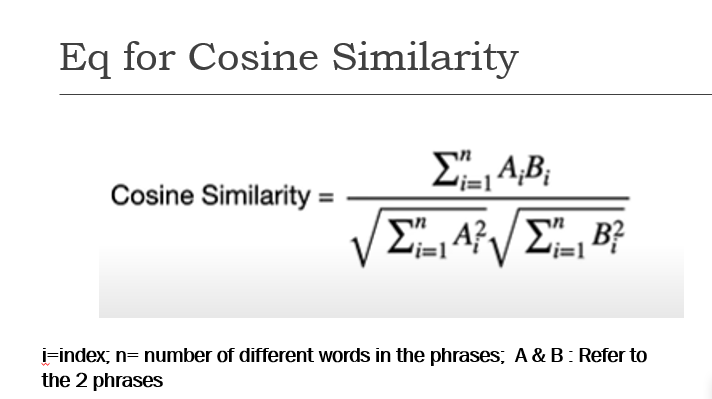

# What is Cosine Similarity?
Cosine similarity is a metric used to measure the similarity of two vectors. Specifically, it measures the similarity in the direction or orientation of the vectors ignoring differences in their magnitude or scale. Both vectors need to be part of the same inner product space, meaning they must produce a scalar through inner product multiplication. The similarity of two vectors is measured by the cosine of the angle between them.

# How to calculate Cosine Similarity
We define cosine similarity mathematically as the dot product of the vectors divided by their magnitude. For example, if we have two vectors, A and B, the similarity between them is calculated as

The similarity can take values between -1 and +1. Smaller angles between vectors produce larger cosine values, indicating greater cosine similarity. For example:

- When two vectors have the same orientation, the angle between them is 0, and the cosine similarity is 1.
- Perpendicular vectors have a 90-degree angle between them and a cosine similarity of 0.
- Opposite vectors have an angle of 180 degrees between them and a cosine similarity of -1.

# Applications
Cosine similarity is beneficial for applications that utilize sparse data, such as word documents, transactions in market data, and recommendation systems because cosine similarity ignores 0-0 matches. Counting 0-0 matches in sparse data would inflate similarity scores. Another commonly used metric that ignores 0-0 matches is Jaccard Similarity.

Cosine Similarity is widely used in Data Science and Machine Learning applications. Examples include measuring the similarity of:
- Documents in natural language processing
- Movies, books, videos, or users in recommendation systems
- Images in computer vision

# Example
Suppose that our goal is to calculate the cosine similarity of the two documents given below.
- Document 1 = 'the best data science course'
- Document 2 = 'data science is popular'

After creating a word table from the documents, the documents can be represented by the following vectors:

Using these two vectors we can calculate cosine similarity. First, we calculate the dot product of the vectors:

